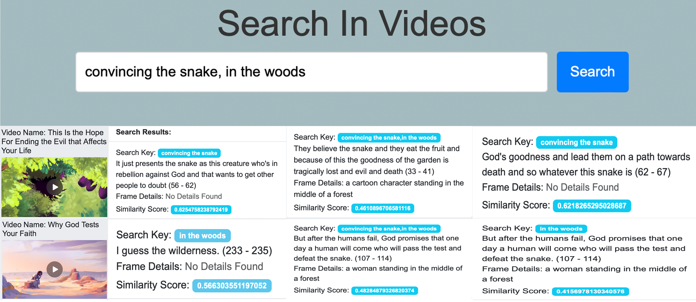

<!-- Improved compatibility of back to top link: See: https://github.com/othneildrew/Best-README-Template/pull/73 -->
<a id="readme-top"></a>
<!--
*** Thanks for checking out the Best-README-Template. If you have a suggestion
*** that would make this better, please fork the repo and create a pull request
*** or simply open an issue with the tag "enhancement".
*** Don't forget to give the project a star!
*** Thanks again! Now go create something AMAZING! :D
-->


<!-- PROJECT LOGO -->
<br />
<div align="center">
  <a href="reports/">
    
  </a>

  <h3 align="center">AI Video Retrieval: A Semantic Search & Timestamp Alignment System</h3>

  <p align="center">
    Read Project Report
    <br />
    <a href="reports/"><strong>Explore the docs »</strong></a>
    <br />
    <br />
    <a href="https://github.com/othneildrew/Best-README-Template">View Demo</a>
    &middot;
  </p>
</div>


<!-- TABLE OF CONTENTS -->
<details>
  <summary>Table of Contents</summary>
  <ol>
    <li>
      <a href="#about-the-project">About The Project</a>
      <ul>
        <li><a href="#built-with">Built With</a></li>
      </ul>
    </li>
    <li>
      <a href="#getting-started">Getting Started</a>
      <ul>
        <li><a href="#prerequisites">Prerequisites</a></li>
        <li><a href="#installation">Installation</a></li>
      </ul>
    </li>
    <li><a href="#usage">Usage</a></li>
    <li><a href="#roadmap">Roadmap</a></li>
    <li><a href="#contributing">Contributing</a></li>
    <li><a href="#acknowledgments">Acknowledgments</a></li>
  </ol>
</details>

<!-- ABOUT THE PROJECT -->
## About The Project

The AI Video Retrieval (AIVR) system enhances video search by integrating deep learning models for speech recognition, image captioning, and embedding generation. It uses txtai for indexing and Django for integration, enabling real-time video processing and semantic search. The system retrieves precise video timestamps based on natural language queries. A usability study confirms its improved retrieval accuracy and efficiency over traditional methods. Future extensions include OCR, object detection, and action recognition for enhanced relevance.

## Project Summary  

### Our Goal  
To develop an AI-powered video retrieval system that enables precise semantic search within videos by leveraging deep learning models for automatic speech recognition, image captioning, and embedding generation. The system aims to enhance retrieval accuracy, efficiency, and usability by indexing multimodal data and providing timestamp-aligned search results, with potential extensions for OCR, object detection, and action recognition.
The content will be formatted for various platforms, including:

---

### Objectives  
- **Develop an AI-driven semantic video retrieval system** – Leverage deep learning models for speech recognition, image captioning, and embedding generation to enable accurate and efficient video search.
- **Enhance retrieval accuracy and timestamp precision** – Implement multimodal indexing and vector embeddings to improve search relevance and ensure precise timestamp alignment for retrieved segments.
- ** Ensure scalability and real-time processing** – Design a framework that supports real-time video uploads, indexing, and search queries while allowing future enhancements like OCR, object detection, and action recognition.
---

<p align="right">(<a href="#readme-top">back to top</a>)</p>

### Built With

This section should list any major frameworks/libraries used to bootstrap your project. Leave any add-ons/plugins for the acknowledgements section. Here are a few examples.

* [![Docker][Docker.com]][Docker-url]
* [![Django][Django.com]][Django-url]
* [![Python][Python.com]][Python-url]
* [![HTML][HTML.com]][HTML-url]
* [![CSS][CSS.com]][CSS-url]
* [![Bootstrap][Bootstrap.com]][Bootstrap-url]

<p align="right">(<a href="#readme-top">back to top</a>)</p>

<!-- GETTING STARTED -->
## Getting Started

The project can be viewed and run locally by installing the following tools.

### Installation, Building, and Running the Project

1. Install Docker Container
   ```sh
   https://www.docker.com/products/docker-desktop/
   ```
2. Install GitHub
  ```sh
  https://docs.github.com/en/desktop/installing-and-authenticating-to-github-desktop/installing-github-desktop
  ```
3. Use Git Clone to create a local repo
  ```sh
  git clone https://github.com/iaminhri/semanticSearch.git
  cd semanticSearch
  ```
4. Build the docker project by using the docker-compose-deploy.yml file.
  ```sh
  docker-compose -f docker-compose-deploy build
  ```
5. Run the Project:
  ```sh
  docker-compose -f docker-compose-deploy up
  ```

<p align="right">(<a href="#readme-top">back to top</a>)</p>

<!-- USAGE EXAMPLES -->
## Usage

# AI Video Retrieval System

## Query & Retrieval


## Query & Retrieval - Compact View


## Upload Videos


## Video Archive and Index


## Single Query Search


## Multiple Query Search


<p align="right">(<a href="#readme-top">back to top</a>)</p>

### Top contributors:

<a href="https://github.com/iaminhri/COSC-4P02/graphs/contributors">
  
</a>

<p align="right">(<a href="#readme-top">back to top</a>)</p>

<!-- LICENSE -->
## License

See `LICENSE.txt` for more information.

<p align="right">(<a href="#readme-top">back to top</a>)</p>

<!-- ACKNOWLEDGMENTS -->
## Acknowledgments

The authors wish to acknowledge the Responsible & Applied Machine Learning Laboratory (RAML Lab) at the Department of Computer Science, Brock University, Canada.

* [Choose an Open Source License](https://choosealicense.com)
* [GitHub Emoji Cheat Sheet](https://www.webpagefx.com/tools/emoji-cheat-sheet)
* [Malven's Flexbox Cheatsheet](https://flexbox.malven.co/)
* [Malven's Grid Cheatsheet](https://grid.malven.co/)
* [Img Shields](https://shields.io)
* [GitHub Pages](https://pages.github.com)
* [Font Awesome](https://fontawesome.com)
* [React Icons](https://react-icons.github.io/react-icons/search)

<p align="right">(<a href="#readme-top">back to top</a>)</p>

<!-- MARKDOWN LINKS & IMAGES -->
<!-- https://www.markdownguide.org/basic-syntax/#reference-style-links -->
[][Docker-url]
[Docker-url]: https://www.docker.com/

[Django.com]: https://img.shields.io/badge/Django-092E20?style=for-the-badge&logo=django&logoColor=green
[Django-url]: https://www.djangoproject.com/

[Python.com]: https://img.shields.io/badge/Python-3776AB?style=for-the-badge&logo=python&logoColor=white
[Python-url]: https://www.python.org/

[HTML.com]: https://img.shields.io/badge/HTML5-E34F26?style=for-the-badge&logo=html5&logoColor=white
[HTML-url]: https://developer.mozilla.org/en-US/docs/Web/Guide/HTML/HTML5

[CSS.com]: https://img.shields.io/badge/CSS3-1572B6?style=for-the-badge&logo=css3&logoColor=white
[CSS-url]: https://developer.mozilla.org/en-US/docs/Web/CSS

[Bootstrap.com]: https://img.shields.io/badge/Bootstrap-563D7C?style=for-the-badge&logo=bootstrap&logoColor=white
[Bootstrap-url]: https://getbootstrap.com

